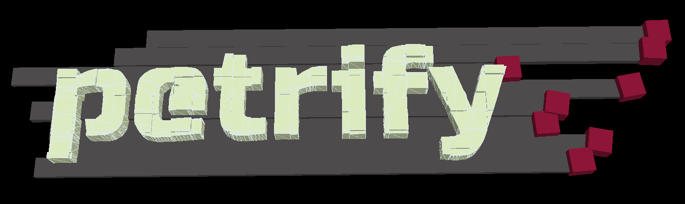

.. image:: https://travis-ci.org/AnIrishDuck/petrify.svg?branch=master
    :target: https://travis-ci.org/AnIrishDuck/petrify

.. image:: https://readthedocs.org/projects/petrify/badge/?version=latest
    :target: https://petrify.readthedocs.io/en/latest/?badge=latest
    :alt: Documentation Status

.. image:: https://mybinder.org/badge_logo.svg
    :target: https://mybinder.org/v2/gh/anirishduck/petrify/master?filepath=examples/solids.ipynb

A library for working with three-dimensional geometry. Designed for CAD / CAM
applications.

To get started with this library, we recommend walking through the demos below.
Each notebook contains links to our comprehensive class and method-level
documentation_.

.. _documentation: https://petrify.readthedocs.io/en/latest/?badge=latest

Online Demo
-----------

Thanks to the magic of binder_, you can try out petrify online. We have demos
for several core petrify features:

- Construction of many basic solids_.
- Methods for defining advanced_ solids.
- Combining_ multiple solids into a single complex solid.

Have patience; notebooks on binder can take up to a minute to start. Due to a
bug in pythreejs, you'll need to click "restart and run all" to see the relevant
interactive visualizations.

.. _binder: https://mybinder.org
.. _solids: https://mybinder.org/v2/gh/anirishduck/petrify/master?filepath=examples/solids.ipynb
.. _advanced: https://mybinder.org/v2/gh/anirishduck/petrify/master?filepath=examples/advanced.ipynb
.. _Combining: https://mybinder.org/v2/gh/anirishduck/petrify/master?filepath=examples/csg.ipynb

Design Principles
-----------------

- **Novice focus**. This library should make it as easy as possible to build
  and manipulate solids, shapes, and other geometry.
- **Immutable operation**. Immutable math is easier for novices to reason about.
  This library explicitly does not target strong real-time applications like
  games that demands mutability for performance.
- **Pluggable engines**. CSG is complicated. Different engines have different
  tradeoffs:

  - The pymesh engine is the default where the pymesh2_ library is installed. It
    uses the IGL engine, which is mature and quite fast. However, building
    pymesh with IGL support can be difficult for novices and in certain
    environments (like Windows).
  - cython-csg is relatively fast, but still requires a cython build toolchain.
  - pycsg is a pure-python implementation. It is obviously quite slow, but works
    everywhere python does. For example, pure python environments like pyiodide_
    can utilize this engine easily.

.. _pymesh2: https://pypi.org/project/pymesh2/
.. _pyiodide: https://github.com/iodide-project/pyodide

Contributors
------------

This library is a fusion of:

- pycsg
- pyeuclid v3 fork (https://github.com/ezag/pyeuclid/)
- the reverbat STL PR on pycsg (https://github.com/timknip/pycsg/pull/9)
